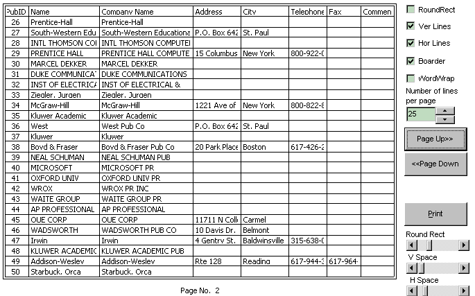



## A Class to Print Recordset \[Updated\]

### Description

[Updated] A class to PRINT or VIEW recordset (ADO or DAO). No need to populate data into DBGrid or MSHFlex. Nice output with or without gridlines. Have a look.
 
### More Info
 

             |
---                |---
**Submitted On**   |2001-12-02 07:11:14
**By**             |[Opal Raj Ghimire](https://github.com/Planet-Source-Code/PSCIndex/blob/master/ByAuthor/opal-raj-ghimire.md)
**Level**          |Intermediate
**User Rating**    |4.9 (102 globes from 21 users)
**Compatibility**  |VB 5\.0, VB 6\.0
**Category**       |[Miscellaneous](https://github.com/Planet-Source-Code/PSCIndex/blob/master/ByCategory/miscellaneous__1-1.md)
**World**          |[Visual Basic](https://github.com/Planet-Source-Code/PSCIndex/blob/master/ByWorld/visual-basic.md)
**Archive File**   |[A\_Class\_to1366819262002\.zip](https://github.com/Planet-Source-Code/opal-raj-ghimire-a-class-to-print-recordset-updated__1-29405/archive/master.zip)

